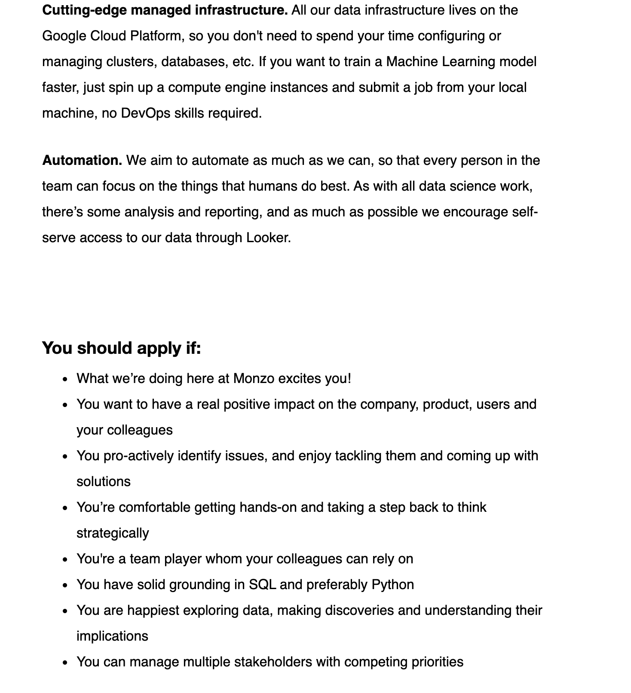

## Table of Contents

1. What is Data Science?
2. What types of jobs exist in Data Science today?
3. What are skills are required to be an effective Data Scientist?
4. How do I get into Data Science?
5. Who's Hiring?

--- .class #id 

## What is Data Science? 

* We live in an AI bubble, almost every company now speaks about being data driven or leveraging the power of Artificial Intelligence, Data Science, Machine Learning etc.

* The term 'Data Science' was first coined by DJ Patil (LinkedIn) and Jeff Hammerbacher (Facebook).

  "_I was at LinkedIn building the data team and Jeff     Hammerbacher was bustling at Facebook's data team... One of the things we realised was that we didn't know what to call ourselves...Do you call yourself an analyst? It feels too Wall Street. A research scientist or statistician? Feels too academic..._" - **DJ Patil**

* Not off to a promising start! But there is hope!

  "_The most important thing is how you use data to interact with the world, study it and try to come up with new things..._" - **DJ Patil**

--- .class #id

## What is Data Science? 
### Intersection of Mathematics and Computer Science

* This definition is fine as a philosophical definition but if we review job descriptions, you get an idea of what the industry considers to be data science.

* Drew Conway's Data Science Venn Diagram

--- .class #id

## What types of jobs exist in Data Science today?

* There are multiple roles available in Data Science and it can be confusing to tell them apart.

* For the purposes of this talk we're going to centre our discussion around 3 major archetypes. 

* Since the definition of Data Science is not very precise or exclusive, there will be fluidity and overlap between these roles.

--- .class #id

## What types of jobs exist in Data Science today?

* Data Analyst/ BI analyst:
  * Mainly responsible for the cleaning, organising, mining and visualising of data in order to generate insights from the data.
  * Typically most of their work is Business Intelligence and KPI Reporting related to the department they're in.
  * These are the most general type of Data Scientist and their focus is on repeated descriptive statistical work which offers the business a reliable and consistent view of the data.
  * Key Skills: Excel/ Google Sheets, SQL, basic knowledge of programming languages and visualisation tools (Tableau). 

--- .class #id

## What types of jobs exist in Data Science today?

--- .class #id

## What types of jobs exist in Data Science today?

--- .class #id

## What types of jobs exist in Data Science today?

--- .class #id

## What types of jobs exist in Data Science today?

* Data Scientist/ Statistical Modeller:
  * Responsible for digging deeper into data to perform inferential analysis and build models.
  * Overlap with Data Analyst but the Data Scientist goes further in implementing more complex statistical algorithms for prediction or product development.
  * Role tends to be more modular and project based.
  * Key Skills: SQL, Python/R/Julia, REST API and App development (Flask and Shiny), Version control/Git, distributed computing and knowledge of statistical algorithms. 

--- .class #id

## What types of jobs exist in Data Science today?

--- .class #id

## What types of jobs exist in Data Science today?

--- .class #id

## What types of jobs exist in Data Science today?

--- .class #id

## What types of jobs exist in Data Science today?

* Data Engineer/ ML Engineer:
  * Responsible for building models and pushing them to production.
  * Responsible for scaling and deployment of models and application. 
  * This is a crucial role because it creates and manages the data science ecosystem. Without this system being properly set up, no effective work in Data Science can be achieved.
  * Key Skills: Python, Data Structures, ML algorithms, Version control/Git, REST API and App Development, Virtualisation/ Docker/ Kubernetes, distributed computing, workflow management, Testing (Unit/ Integration).

--- .class #id

## What types of jobs exist in Data Science today?

--- .class #id

## What types of jobs exist in Data Science today?

--- .class #id

## Cross Functional or Specialised

* In product led technology companies like Facebook, Google, Uber, Deliveroo, Monzo etc. There are cross functional teams of software engineers, product managers and Data Scientists who use Data Science to drive decision making.

* It is less common to see Data Scientists/ Data Analysts and Data Engineers in their own dedicated functions, their efficacy is maximised when they're embedded within the product, when we do see this it tends to be in academic research or consultancy based businesses.

* For most companies, the data revolution is underway and is in different stages - this is true for start ups as well. Increasingly seeing early stage start ups (fewer than 50 people) employ data people to look at their performance to see how they can make informed better decisions.

---  &checkbox

## Quiz

Which of the 3 Data Science roles that we've discussed today would be responsible for setting up and maintaining a Data Warehouse?

1. Data Analyst
2. Data Scientist
3. _Data Engineer_

*** .hint

This would be a data architecture decision which would affect all aspects of the data workflow.

*** .explanation

This would traditionally be a Data Engineer's job.

--- .class #id

## What are the skills required to be an effective Data Scientist?

* Programming:
  1. Fundamental - we deal with large amounts of data which cannot be held in spreadsheets. We require databases and require skills like SQL to extract the data we need to perform our analysis.
  2. Programming languages like Python/ R/ Julia are necessary to extract, transform, model and visualise data. The libraries offered in these languages allow us to perform all types of analysis from stochastic modeling to Natural Language Processing to Machine Learning!
  3. Visualisation tools like Tableau/ Looker.
  4. What about purpose built tools like SPSS, Alteryx, etc? 

--- .class #id

## What are the skills required to be an effective Data Scientist?

* Statistical Literacy:
  1. Once we have good data and tools for analysing data we need an understanding how to effectively interrogate our data.
  2. The general Data Science workflow can be described by the PPDAC cycle

--- .class #id

## What are the skills required to be an effective Data Scientist?

* Statistical Literacy:
  1. Formal methods: A/B Testing, Experimental Design, Probability theory and Statistical Modeling techniques.
  2. Data Wrangling: A key skill which differentiates the experienced and inexperienced Data Scientist.
  
* General Workflow:
  1. Git and Version control
  2. REST API and web app development/ deployment

* Visualisation and Communication
* Passion!

--- .class #id

## How do I get into Data Science?

### Effective Ways to Develop Knowledge

* You don't need a Mathematics or Computer Science Degree to do this!

* Courses
  * Statistics 110: Probability by Joe Blitzstein
  * Andrew Ng Coursera Series on Machine Learning
  * Richard McElreath Statistical Rethinking
  * Introduction to Statistical Learning by Hastie and Tibshirani
  * Linear Algebra 18.06 by Gilbert Strang

--- .class #id

## How do I get into Data Science?

### Effective Ways to Develop Knowledge
* Key Books
  * Art of Statistics by David Spiegelhalter (General)
  * Probability and Statistics for Data Science - Norm Matloff
  * Applied Predictive Modeling - Max Kuhn
  * Introduction to Data Mining - Kumar et al.
  * Deep Learning for coders with fastai and Pytorch - Jeremy Howard
  * Python Data Science Handbook - Jake VanderPlas
  * Python for Data Analysis - Wes McKinney
  * Probability and Statistics - Morris Degroot

--- .class #id

## How do I get into Data Science?

### Effective Ways to Develop Knowledge

* Follow influential Data Scientists in the community:
  * StatQuest on Youtube 
  * Hadley Wickham
  * Julia Silge
  * Andrew Gelman
  * David Robinson
  * Jake VanderPlas

--- .class #id

## How do I get into Data Science?

* If you have a good foundation of programming and statistical skills then you can do the following   

* Projects - Like Software Engineering, it helps to have a portfolio of Data Science projects in which you've demonstrated key technical skills. The best place to show these projects is Github; decorate your Github with key projects that you can talk to employers and the community about. Try to be involved in as many side projects as possible. 

* Build web apps with statistics/ ML integrated - Flash/ Shiny. Many prominent Data Scientists have small scale web apps deployed via platforms like Heroku which performs a function and shows technical ability. These don't have to be ground breaking or original!

* Be involved in community Data Science initiatives and activities. Kaggle, Tidy Tuesday (for R), check EventBrite/ Meetup for Data Science meetups and attend - the community is very helpful. 

--- .class #id

## Future of Data Science - Where I think the field is going

* Emergence of Data Science tools which are abstracting more and more of the traditional Data Science workflow. Key example is LookerML, AutoAI etc. 
* General move toward Data Engineering - these skills are increasingly more in demand and if the engineer has a good understanding of statistics, it can often be desirable for companies to hire these people.
* Core Data Science work is moving to specialised subjects (NLP, Graphical methods, Reinforcement Learning etc). 
* I personally recommend Data Engineering if you are intrigued by Data Science but are not in love with statistics. 

--- .class #id

## Who's Hiring?

* Most companies are hiring for data related roles. The notable companies that are hiring for Data Scientists year round are:
  - Facebook
  - Monzo
  - Deliveroo
  - Supermarkets (Tesco/ Sainsburys, etc)
  - Consultancies (EY, Mckinsey, PWC, etc)
  - Microsoft/ IBM
  - Many more
* Many start ups are also hiring for data related roles. I would recommend careful deliberation when considering taking a data focused role at a start up if you're inexperienced. I wrote a blog post about it!

--- .segue bg:grey

## Thank you for your attention!
